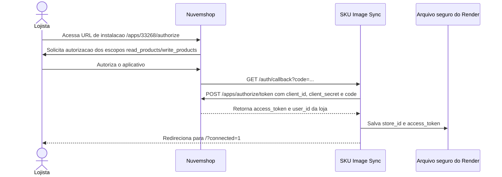
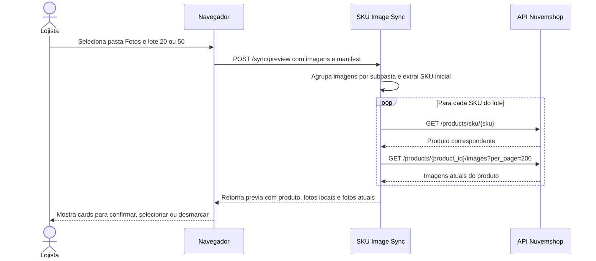
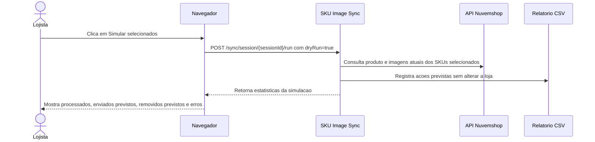
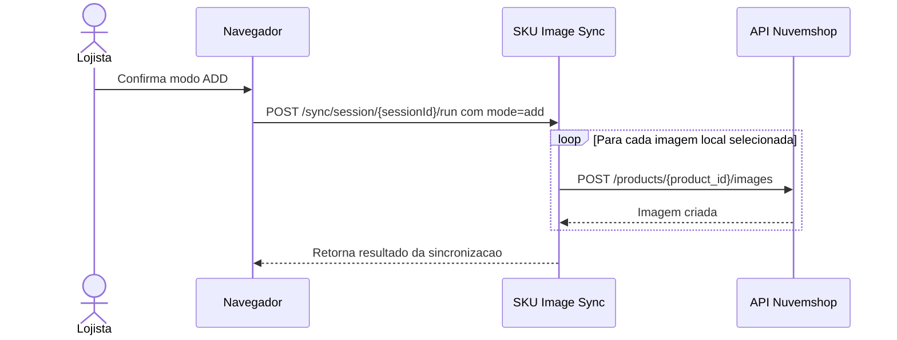
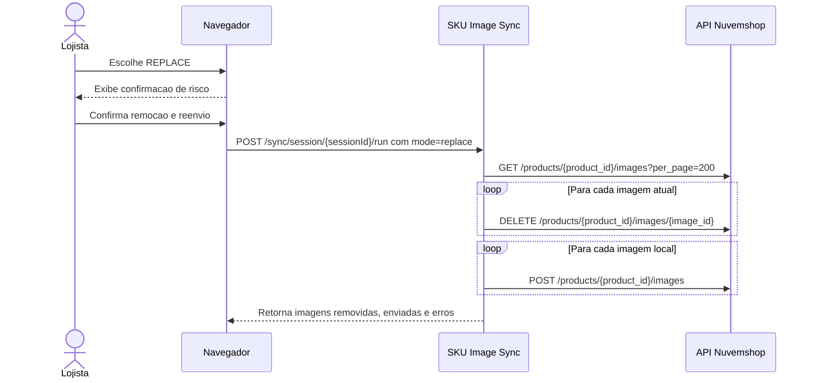
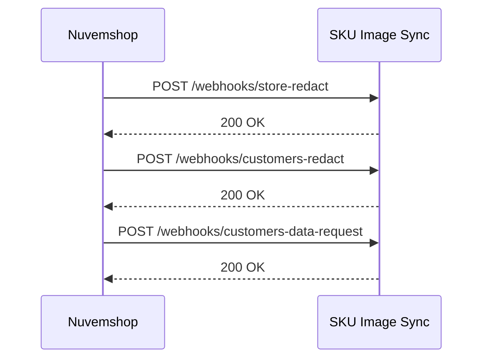

# Diagrama de sequencia - SKU Image Sync

Este documento representa os fluxos tecnicos do aplicativo e como os escopos da API Nuvemshop sao utilizados.

## Escopos

| Escopo | Uso no aplicativo |
| --- | --- |
| `read_products` | Buscar produto por SKU e listar imagens atuais do produto. |
| `write_products` | Enviar imagens novas e remover imagens antigas quando o usuario confirma uma sincronizacao. |

## 1. Instalacao OAuth

Resultado: o aplicativo fica conectado a loja autorizada e pode consultar produtos e sincronizar imagens conforme acao do lojista.

## 2. Geracao de previa

Escopo utilizado: `read_products`.

## 3. Simulacao antes de sincronizar

Escopo utilizado: `read_products`.

## 4. Sincronizacao ADD

Escopos utilizados: `read_products` e `write_products`.

## 5. Sincronizacao REPLACE

Escopos utilizados: `read_products` e `write_products`.

## 6. Webhooks LGPD

Resultado: o app responde aos webhooks obrigatorios de privacidade. O app nao armazena dados de clientes.

